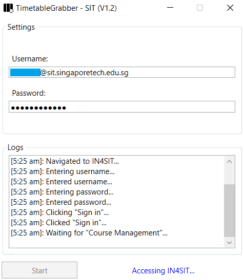
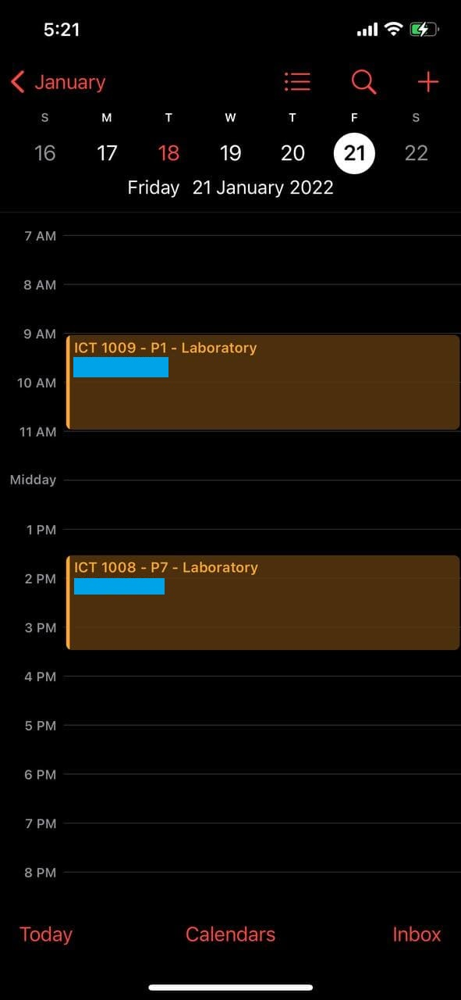
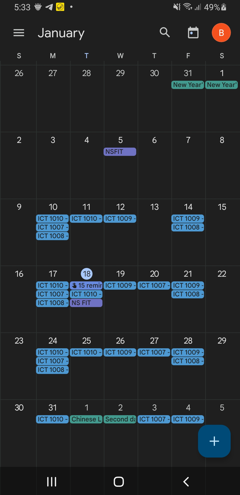

## Introduction

TimetableGrabber - SIT is a tool that allows you to grab and export your trimester's timetable to the .ics format where you can import it to your favourite calendar.

## Showcase

User Interface of TimetableGrabber - SIT

TimetableGrabber - SIT exported to iOS

TimetableGrabber - SIT exported to Android
